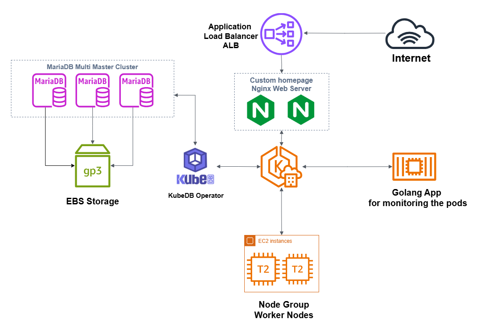

# Kubernetes Cluster Deployment and Monitoring

This project demonstrates a comprehensive Kubernetes deployment using Amazon EKS (v1.31) on AWS with two `t2.large` worker nodes. It showcases essential Kubernetes concepts, including deploying a MariaDB database with persistent storage, a highly available web server, and custom configurations. Additionally, it includes a custom-built Golang monitoring application to track pod lifecycle events.

The deployment is managed via Helm charts, ensuring repeatability and efficiency.

## Features

1. **Kubernetes Cluster Deployment**:
   - Cluster created using Amazon EKS with essential add-ons.
   - Worker nodes with sufficient resources to handle workloads.

2. **Database Deployment**:
   - MariaDB cluster deployed on Kubernetes with persistent storage (provided by Amazon EBS CSI Driver).

3. **Web Server Deployment**:
   - Multi-replica web server setup using Nginx.
   - Custom web server configuration mounted to pods.
   - A variable updated in an init container which shows a custom value.
   - The custom homepage can be accessed via a browser using the ALB URL. 

4. **Monitoring**:
   - Custom Golang application monitoring pod lifecycle events.
   - Logs events such as pod creation, deletion, and updates in real-time.
   - The Docker image for this application is built with GitHub Actions after each push, and the image is then pushed to the GitHub Package Repository. The deployment pulls the image from the repository.

5. **Helm Chart Management**:
   - All components deployed using Helm for consistency and scalability.

## Add-Ons Used

To support the deployment on Amazon EKS, the following add-ons are enabled:
- **Amazon VPC CNI**: Handles networking for Kubernetes pods in the EKS cluster.
- **kube-proxy**: Manages network rules on nodes.
- **Amazon EKS Pod Identity Agent**: Ensures IAM role-based permissions for pods.
- **Amazon EBS CSI Driver**: Provides persistent storage for the MariaDB cluster.
- **CoreDNS**: Offers internal DNS resolution for the cluster.

---

The following sections provide step-by-step guidance for deploying and managing each component.




# Kubernetes Cluster Deployment

## EKS Cluster Setup

1. **Configure AWS CLI**  
   Set up AWS CLI using the provided Access Key ID and Secret Access Key with sufficient privileges:
   ```bash
   aws configure
   ```

2. **Clone the Repository**  
   Clone the repository containing the Terraform configuration for the EKS cluster:
   ```bash
   git clone https://github.com/emiakia/aws_eks_provider_simple
   cd aws_eks_provider_simple
   ```

3. **Initialize Terraform**  
   Initialize the Terraform configuration:
   ```bash
   terraform init
   ```

4. **Plan the Deployment**  
   Review the resources Terraform will create:
   ```bash
   terraform plan
   ```

5. **Apply the Terraform Configuration**  
   Deploy the EKS cluster by applying the configuration:
   ```bash
   terraform apply
   ```

   Wait for several minutes until the cluster creation completes.

6. **Verify Cluster Creation**  
   After deployment, verify the cluster with the following command:
   ```bash
   aws eks list-clusters
   ```

7. **Update kubeconfig**  
   Set the kubeconfig to interact with the new EKS cluster:
   ```bash
   aws eks update-kubeconfig --region <region> --name <cluster-name>
   ```

8. **Verify Connectivity**  
   Ensure the Kubernetes cluster is up and running by checking the nodes:
   ```bash
   kubectl get nodes
   ```

   The cluster is now ready for further steps.

## Clean Up (Post-Demo)

After the demo or testing, run the following command to avoid incurring extra costs:
```bash
terraform destroy
```

## Database Deployment

In this section, we will deploy a MariaDB instance using KubeDB, which simplifies managing databases on Kubernetes.

### 1. Install Helm
To begin, install Helm by following the official installation instructions for your environment:  
[Helm Installation Guide](https://helm.sh/docs/intro/install/)

### 2. Install KubeDB

1. Add the KubeDB Helm chart repository:
   ```bash
   helm repo add appscode https://charts.appscode.com/stable/
   helm repo update
   ```

2. Install the KubeDB Operator:
   ```bash
   helm install kubedb-operator appscode/kubedb --version v2024.8.21 --namespace kubedb --create-namespace --set-file global.license=/root/license.txt
   ```

   The `license.txt` file must be obtained from the AppsCode License Server:
   - Visit the [KubeDB Setup Page](https://kubedb.com/docs/v2024.11.18/setup/install/kubedb/)
   - Click on "Download a FREE license from AppsCode License Server"
   - Fill in the required fields.
   - Retrieve the lincense from your email and make the license.txt in suitable path.

   The **Kubernetes Cluster ID** can be found using the following command:
   ```bash
   kubectl get ns kube-system -o=jsonpath='{.metadata.uid}'
   ```

3. To verify that the KubeDB Operator is running:
   ```bash
   kubectl --namespace kubedb get pods
   ```

### 3. Install the MariaDB Cluster

1. Navigate to the `mydbcluster-helm` directory:
   ```bash
   cd mydbcluster-helm
   ```

2. Install the MariaDB cluster using Helm:
   ```bash
   helm install -f values.yaml -n demo mydbcluster .
   ```

   Alternatively, you can use this command if you prefer to install in the `demo` namespace:
   ```bash
   helm install -f values.yaml --namespace demo --create-namespace mydbcluster .
   ```

### 4. Verify the Database Deployment

1. Verify the MariaDB pods are running:
   ```bash
   kubectl get pod -n demo
   ```

   You should see three pods named `data-mydbcluster-mariadb-[0..2]`.

### Verifying MariaDB Cluster and Data Consistency

To verify your MariaDB cluster setup and ensure that data is consistent across nodes, follow these steps:

1. **Connect to the First Node (Pod) in the Cluster:**
   Use the following `kubectl exec` command to access the first MariaDB node:

   ```bash
   kubectl exec -it -n demo data-mydbcluster-mariadb-0 -- bash

2. **Login to MariaDB: Once inside the pod, log in to the MariaDB instance with the root credentials:**

   ```bash
    mysql -u${MYSQL_ROOT_USERNAME} -p${MYSQL_ROOT_PASSWORD}

3. **Verify Databases: After logging in, check the existing databases with the following command:**

   ```bash
   show databases;

4. **Create a Test Database: Create a new database to test the cluster's functionality:**

   ```bash
   create database test;
5. **reate a Table and Insert Data: Switch to the test database, create a table, and insert a sample record:**

   ```bash
   use test;
   create table t1 (id integer);
   insert into t1 values(1);
6. **Exit the Pod: To exit the MariaDB shell, use Ctrl+D. To exit the pod shell, type:**

   ```bash
   exit

7. **Verify Data on Other Pods: To ensure data is replicated across the cluster, repeat the above steps on another MariaDB pod in the cluster. First, connect to the second pod:**

   ```bash
   kubectl exec -it -n demo data-mydbcluster-mariadb-1 -- bash
   ```
Then, follow the same steps to log in to MariaDB and verify that the test database and its data exist.

   ```bash
   mysql -u${MYSQL_ROOT_USERNAME} -p${MYSQL_ROOT_PASSWORD}
   show databases;
   use test;
   select * from t1;
   ```
You should see the data inserted in the first pod selected in the second pod.

## Nginx Web Server Deployment

This guide explains how to deploy an Nginx web server on Kubernetes with multiple replicas, each serving a custom page showing the `serving-host` with the last 5 characters of the pod name.

## Prerequisites

- Kubernetes cluster set up and kubectl configured.
- Helm installed and configured.
- Access to the `mynginx-helm` directory.

## Steps

### 1. Navigate to the `mynginx-helm` directory

Change to the directory where your Helm chart for Nginx is located:

   ```bash
   cd mynginx-helm
   ```
### 2. Install the Nginx Helm chart
Run the following command to install the Nginx web server with the provided values.yaml configuration. This will deploy the web server in the demo namespace.

   ```bash
   helm install -f values.yaml -n demo mynginx .
   ```
This command will deploy the Nginx web server with multiple replicas.

### 3. Check the deployed services
After the Helm chart is installed, check the services running in the demo namespace to get the external IP of the Nginx service:

   ```bash
   kubectl get svc -n demo
   ```
Look for the EXTERNAL-IP under the mynginx service, which will be the public URL for accessing the web server.

### 4. Access the web server from the browser
Once the external IP is obtained, you can open a web browser and navigate to the following URL (replace the IP with your actual external IP):

   ```bash
   http://<external-ip>/
   ```

For example:

   ```bash
   http://a5c1552afd4254ee2a385474f5e6f685-450644057.eu-central-1.elb.amazonaws.com/
   ```

### 5. Verify the page content
Once you access the page, you should see something like:

   ```bash
   serving-host=Host-p75lk
   ```

Where p75lk represents the last 5 characters of the pod name, which is unique to each pod replica.

### Troubleshooting
Ensure that the Nginx service is correctly exposed with the proper external IP.
If the page doesn't load, verify the pod and service status using:
   ```bash
   kubectl get pods -n demo
   kubectl get svc -n demo
   ```

### Cleanup
To delete the deployment, you can run the following command:

   ```bash
   helm uninstall -n demo mynginx
   ```

This will remove the Nginx web server and associated resources from the demo namespace.


# Golang Application Monitoring on Kubernetes

This repository provides a setup for monitoring a Golang application using Kubernetes and Helm. It includes configuration for accessing AWS and EKS resources, pulling Docker images from a private GitHub repository, and deploying the monitoring system to Kubernetes.

## Prerequisites

Before deploying the monitoring system, ensure you have the following:

- **Kubernetes Cluster** (EKS or other)
- **kubectl** command-line tool installed and configured for your cluster
- **Helm** installed on your local machine
- AWS Access Key and Secret Key for interacting with AWS services
- A valid GitHub Container Registry token for pulling Docker images from your private repository

## Steps

### 1. Create Secrets for AWS and EKS Access

We need to store the AWS credentials and EKS configuration in Kubernetes secrets.

#### AWS Credentials Secret
Store your AWS Access Key and Secret Key in a secret.

```bash
kubectl create secret generic awssecret \
  --from-literal=AWS_ACCESS_KEY_ID=your-access-key-id \
  --from-literal=AWS_SECRET_ACCESS_KEY=your-secret-access-key \
  -n demo
```

EKS Configuration Secret
Store your kubeconfig file for accessing EKS resources.

```bash
kubectl create secret generic myrootsecret \
  --from-file=config=/root/.kube/config \
  -n demo
```

### 2. Create a Docker Registry Secret for GitHub Container Registry
If you need to pull Docker images from a private GitHub Container Registry, create a secret to authenticate.

```bash
kubectl create secret docker-registry ghcr-secret \
  --docker-server=ghcr.io \
  --docker-username=<your-github-username> \
  --docker-password=<your-token> \
  --docker-email=<your-email> \
  -n demo
```

Replace <your-github-username>, <your-token>, and <your-email> with your GitHub credentials.

### 3. Deploy the Monitoring System using Helm
Ensure your values.yaml contains the correct configurations for the monitoring setup (including image names, environment variables, etc.). Then, install the Helm chart:

```bash
helm install -f values.yaml -n demo mymonitoring .
This will deploy your monitoring application to the demo namespace in your Kubernetes cluster.
```

### 4. Verify the Deployment
After deployment, you can check the status of your pods to ensure everything is running correctly.

Check Pods
```bash
kubectl get pod -n demo
```

Check Logs
To check the functionality of the application, issue the command below to verify that it is running as expected. You can also check the logs of the deployed pods:
```bash
kubectl logs -f <pod-name> -n demo
```
Replace <pod-name> with the actual pod name.

You can delete any other pod or deploy a different deployment to verify the functionality.

### Explanation:
- The **Prerequisites** section lists the requirements for running the monitoring setup.
- The **Steps** section breaks down how to create necessary secrets for AWS/EKS access, Docker registry, and how to install the Helm chart.
- **Verifying Deployment** includes commands to check the status and logs of the deployed application.
- **Troubleshooting** provides tips for debugging issues during the deployment.

### Suggestions for Improvement

1. **Integrate ArgoCD for Deployment**  
   Use ArgoCD to automate GitOps-based deployments, enabling version control, traceability, and streamlined environment syncs.

2. **Centralized Logging**  
   Send Golang app logs to **CloudWatch** or **ELK Stack** for better observability, historical tracking, and troubleshooting. Configure logging agents (e.g., FluentD, Filebeat) for seamless integration.

